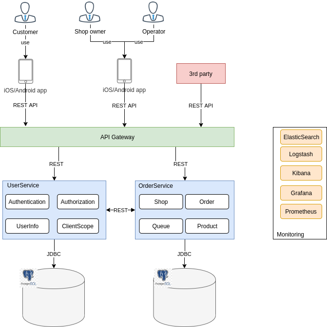

# CoffeeShop microservices
This repository contains microservices for CoffeeShop microservices including:
- digital-api-gateway: API routing and authentication based on Springboot and Zuul
- digital-userservice: User management, OAuth provider, ... based on Springboot
- digital-orderservice: Handle coffeeshop business logic Order, Product, Shop management, ... based on Springboot
# High level design

# API Documentation
`https://app.swaggerhub.com/apis/vietnq68/API/1.0.0`
[API Documentation](https://app.swaggerhub.com/apis/vietnq68/API/1.0.0)

# How to test
1. Using docker-compose to start db and microservices
```
docker-compose up
```
2. Init database structure and demo data.
- userservice
```
cd digital-userservice
mvn liquibase:update
```
- orderservice
```
cd digital-orderservice
mvn liquibase:update
```
3. Import `coffeeshop.postman_collection.json` to Postman to test API //TODO automate test by jmeter or RobotFramework (`https://robotframework.org/`)
# How to build
For each microservice, run following commands, for ex:
```
mvn clean install
docker build -t quocvi3t/digital-userservice:1.0 .
```
# TODO
- add Authorization for ROLE_CUSTOMER, ROLE_OPERATOR, ROLE_OWNER with least privileges principle
- automate testing with RobotFramework (`https://robotframework.org/`)
- introduce cache for better performance when generating new order ticket (position code)
- concurrency handling 
